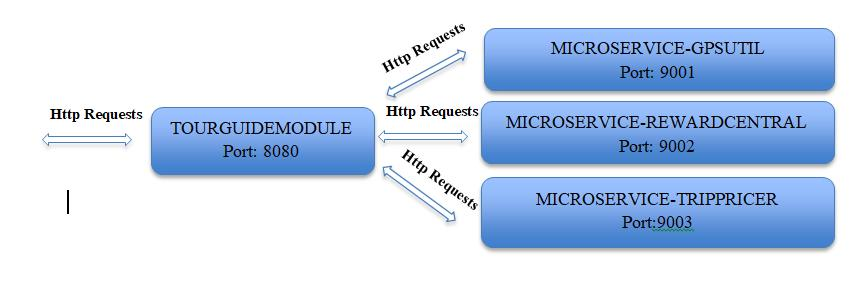
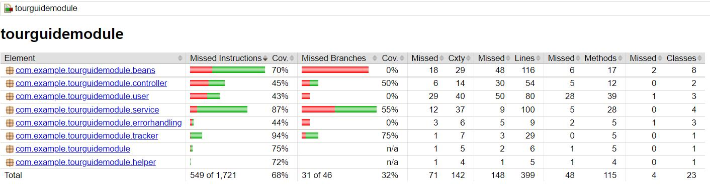

#TourGuide

## P8 Openclassrooms Application

**Usage:**
-follow user location
-show attractions to visit, near present location
-win reward points by visiting attractions
-store user's trip preferences
-special trip offers, according each user's preferences

**Installation:**
> > - Java
> > - Gradle
> > - Docker Desktop

**Architecture**

**Test Report**

